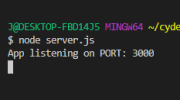
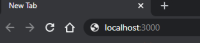
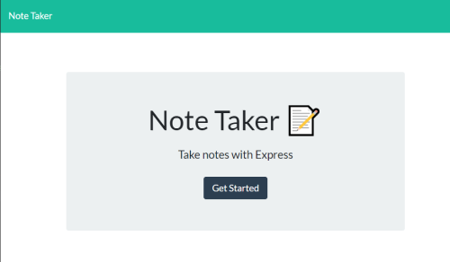
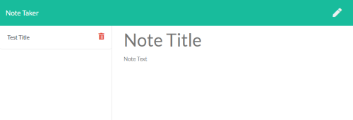
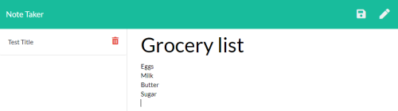
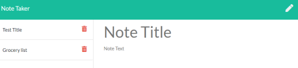
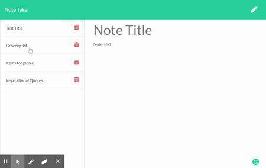
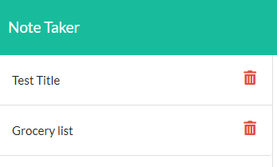
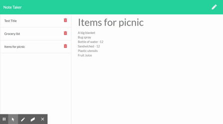

# Note Taker Application

## Description 

This application allows user to create, save, and delete notes.  It is able to record alot of information and display details of the note as user toggle through the title of the note. User can delete any of the previous saved note from the list. This application uses Express backend to save, retrieve note data from a JSON file.  

## Installation
### Steps required running the app through __local server__:

In the terminal mode, user must first run __npm install__ to have its package dependecies. Then, user can run the __server.js__ file in Node environment by running __node server.js__. \
 \
Then after sucessfull connection, user need to type _localhost:3000_ in the browser to access index.html. \
 

### Steps required running the app through __Heroku__:

This application is also hosted in Heroku web server. \
Click this link: https://warm-cove-79367.herokuapp.com/ to access this application.

## Usage 
### Main Page: index.html
Using either method, user will be navigated to the main Note Taker page. \
To begin the note taking process, user must click the __Get Started__ button presented in this page. \

### Note Taker: notes.html
After clicking the  __Get Started__ button, user will be navigated to the note taker page. \

To write a note: user can begin writting in the note section on the right of the page. \
As user typed-in the title of the note, a save button icon will appear on the top right corner of the page. \

To save a note: User can save their note by clicking this icon then the title of the note will appear on the left with a delete button to its right. \

Toggling from several notes: User can toggle any saved note by clicking on the title of the note from the list. \
Demo preview: \

To delete: User can delete a note by clicking the delete icon displayed on the right of the note title from the list section. \

Adding a new note: To add a new note, user need to click on the pencil icon displayed on the top right corner of the page. \

## MAINTAINER 
This is an individual assignment created by Carolina Yoedhana.
* GitHub repo: git@github.com:CarolinaYo/express-notetaker.git
